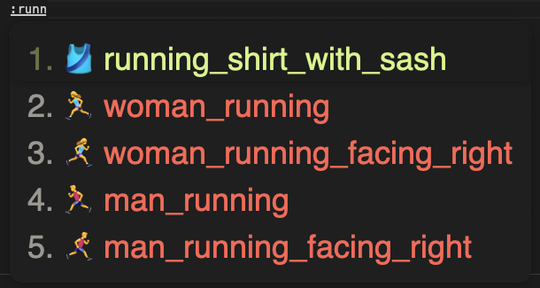

# Rime Emoji Translator

github 或者 slack 内的绘文字标记，比如 `:grinning:`，使用起来十分顺手，于是用 lua 实现了一份绘文字 translator，主要功能：
1. `:emoji_name`：模糊查找
2. `:emoji_name:`：精确查找

## 数据来源
1. 英文名：https://github.com/iamcal/emoji-data
2. 中文名：https://github.com/iDvel/rime-ice

## 截图

| 中文，模糊查找 | 中文，精确查找 | 英文，模糊查找 | 英文，精确查找 |
|--|--|--|--|
|  |  |  |   |

## 集成

1. 把 `schema` 里面的内容拷贝到 rime 配置文件夹
2. 把 `emoji_translator.yaml` 里的内容添加入至想添加Emoji的方案custom檔中
